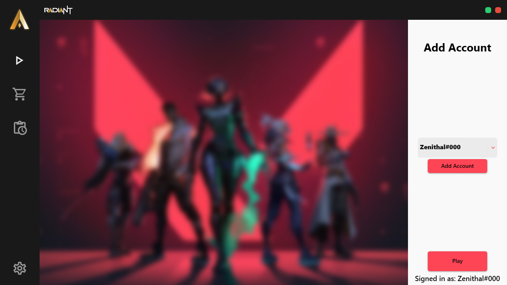

### A custom launcher for VALORANT with added features.

 

## [Download Latest](https://github.com/Apexcery/RadiantLauncher/releases/download/v1.0.0.2/Radiant-v1.0.0.2.msi)

 

## Features
- Have up to 5 accounts saved at a time to switch between at will.
- View the store (including rotating items and night market when available).
- View your ranks from previous acts.
- View your match history.
- Customize the app to your tastes (colour theme, button styles).

 Screenshots 

## Home

## Store

## Career

## Settings

 

 

### Credits
- Developed by: [Apexcery](https://github.com/Apexcery)
- Heavily inspired by: [Assist](https://github.com/RumbleMike/Assist)